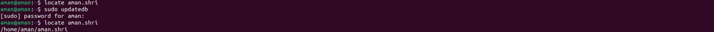
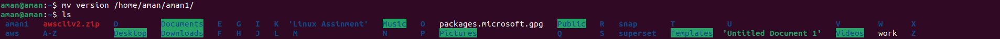

# Linux Commands

## 1.How to make a directory


```
mkdir aman2
```

 **mkdir** = command is a fundamental tool in file system management, allowing users to organize and structure their files by creating new directories as needed.

 **aman2** = is the name of directory.

## Output

```
aman@aman:~$ mkdir aman2
aman@aman:~$ ls
 aman1          Documents                Pictures   'Untitled Document 1'
 aman2          Downloads                Public      version
 aws           'Linux Assinment'         snap        Videos
 awscliv2.zip   Music                    superset
 Desktop        packages.microsoft.gpg   Templates
``````


## 2.Remove a directory

``````
rmdir aman2
``````
**rmdir** = is used for remove directory..

**aman2** = is the name of directory.

## Output 

``````
aman@aman:~$ rmdir aman2
aman@aman:~$ ls
 aman1   aws   awscliv2.zip   Desktop   Documents   Downloads  'Linux Assinment'   Music   packages.microsoft.gpg   Pictures   Public   snap   superset   Templates  'Untitled Document 1'   version   Videos
aman@aman:~$ 
``````


**Note:** rmdir removes only empty directories.

## 3.Make a copy of a file

To Make a copy of a file follow the command given below

First we have to know the existing file path which i want to copy in another folder.To know the path of the file we will use the command given below:

``````
sudo apt install plocate 
``````

## Output

``````
aman@aman:~$  sudo apt install plocate 
[sudo] password for aman: 
Reading package lists... Done
Building dependency tree... Done
Reading state information... Done
The following NEW packages will be installed:
  plocate
0 upgraded, 1 newly installed, 0 to remove and 5 not upgraded.
Need to get 129 kB of archives.
After this operation, 512 kB of additional disk space will be used.
Get:1 http://in.archive.ubuntu.com/ubuntu jammy/main amd64 plocate amd64 1.1.15-1ubuntu2 [129 kB]
Fetched 129 kB in 1s (144 kB/s)   
Selecting previously unselected package plocate.
(Reading database ... 290463 files and directories currently installed.)
Preparing to unpack .../plocate_1.1.15-1ubuntu2_amd64.deb ...
Unpacking plocate (1.1.15-1ubuntu2) ...
Setting up plocate (1.1.15-1ubuntu2) ...
update-alternatives: using /usr/bin/plocate to provide /usr/bin/locate (locate) in auto mode
Adding group `plocate' (GID 142) ...
Done.
Initializing plocate database; this may take some time... done
Created symlink /etc/systemd/system/timers.target.wants/plocate-updatedb.timer → /lib/systemd/system/plocate-updatedb.timer.
Processing triggers for man-db (2.10.2-1) ...
aman@aman:~$ ^C
``````

In the abbove command:

    'sudo' is for root prevelge.
    'apt' is for advance package tool.
    'install' is to install the package.
    'plocate' is the package name.

Now well will locate the file with the command:


```
aman@aman:~$ locate aman.shri
/home/aman/aman.shri
``````
## Output 

``````
/home/aman/aman.shri
``````


Now we have the path of the file with the name aman.shri

To copy the file in the other directory use command:
``````
aman@aman:~$ cp /home/aman/aman.shri /home/aman/Desktop/
``````
In the above command:

  *  'cp' is used for copy the file

now fo to the Desktop directory with the command:
```
cd Desktp
```

## (output)
```
aman@aman:~/Desktop$ ls
aman.shri
`````


# 4. Move or rename a file

To rename a file, we will use command :

first we have to go in the directoruy by the cd command.

``````
cd Desktop
``````
In the above command:
- 'cd' is used for change the direcotory.
- 'Desktop' is the name of directory.
  
``````
aman@aman:~$ mv aman.shri work
``````
## Output

``````
aman@aman:~/Desktop$ ls
aman.shri
``````


To check that file is moved or not type 'ls

## Output

``````
aman@aman:~/aman1$ ls
version
``````


# 5. Create an empty file

To create a empty file use the command below:

```
aman@aman:~$ touch gaurav
``````

In the Above command :

* 'touch' is to make the file.

* 'gaurav' is the name of file.

To see the file type 'ls' and press enter

## Output 
``````
aman@aman:~$ ls
 aman1          A-Z       Documents   F        H   K                  M       O                        Pictures   Q      S          T           U                      Videos   X
 aws            D         Downloads   G        I   L                  Music   P                        pinki      R      snap       taj        'Untitled Document 1'   W        Z
 awscliv2.zip   Desktop   E           gaurav   J  'Linux Assinment'   N       packages.microsoft.gpg   Public     ritu   superset   Templates   V                      work

``````
as we can see that the file is created.


# 6. Remove multiple files with a single command

To remove multiple files with a single command use the command below:

As we can see in the above image that we have 3 files with the name " ritu, pinki, taj "


Now we will remove thies files with single command:

``````
aman@aman:~$ rm ritu taj pinki
``````
In the above command:
- 'rm' is used for removing the files 
- 'ritu,taj,pinki' are names of teh files. 

## (output)


# 7. Remove content from the folder without removing folder

To remove content from the folder without removing folder use the command given below:

``````
aman@aman:~$ rm /home/aman/a
``````
In the above command :
- 'rm' is used for removing the content.
- '/home/aman/a is the path of the content.

## (Output)

``````
aman@aman:~$ rm /home/aman/aman1/version
aman@aman:~$ ls
 aman1   awscliv2.zip   D         Documents   E   G        H   J   L                  M       N   P                        Pictures   Q   S      superset   Templates  'Untitled Document 1'   Videos   work   Z
 aws     A-Z            Desktop   Downloads   F   gaurav   I   K  'Linux Assinment'   Music   O   packages.microsoft.gpg   Public     R   snap   T          U           V                      W        X
aman@aman:~$ cd aman1/
aman@aman:~/aman1$ ls
``````


As we can see there is nothing in the above image there is no contant in the directory.


# 8. Create multiple folder(a-z) with a single command

To Create multiple folder(a-z) with a single command follow the command given below:

```
mkdir {A..Z}
``````

In the above command :

    'mkdir' is used for making the directories.
    'A..Z' is used for making all directories from A to Z.

## (output)

``````
aman@aman:~/A-Z$ mkdir {A..Z}
aman@aman:~/A-Z$ ls
A  B  C  D  E  F  G  H  I  J  K  L  M  N  O  P  Q  R  S  T  U  V  W  X  Y  Z
aman@aman:~/A-Z$ 
``````


As we can see in the above image that all directories are made with the single command.
